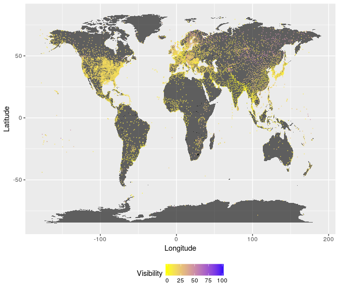

<!-- README.md is generated from README.Rmd. Please edit that file -->
gsod: Tools for using NOAA Global Surface Summary of the Day data
=================================================================

Installation
------------

``` r
if(!require(devtools)) install.packages("devtools")
install_github('databrew/gsod')
```

Purpose
-------

[GSOD data](https://data.noaa.gov/dataset/global-surface-summary-of-the-day-gsod), with daily meterological summaries of over 9,000 weather stations around the world, is large, stored in tens of thousands of different files, and a bit difficult to quickly access and use. The purpose of the `gsod` package is to make accessing and analyzing GSOD data quicker and easier.

Use
---

The `gsod` package consists of 18 dataframes, one for each year from 2000 through 2017. To access any of these dataframes, simply attach the package and then type `gsod<year>`. For example:

``` r
library(gsod)
my_data <- gsod2016
head(my_data)
#>         date temp max min prcp usaf wban        stnid stn_name ctry lat
#> 1 2016-06-22 34.8  38  31    0 <NA> <NA> 007026-99999     <NA> <NA>  NA
#> 2 2016-06-23 31.3  37  26    0 <NA> <NA> 007026-99999     <NA> <NA>  NA
#> 3 2016-06-24 26.9  34  21   NA <NA> <NA> 007026-99999     <NA> <NA>  NA
#> 4 2016-06-25 27.4  32  23    0 <NA> <NA> 007026-99999     <NA> <NA>  NA
#> 5 2016-06-26 26.9  33  21    0 <NA> <NA> 007026-99999     <NA> <NA>  NA
#> 6 2016-06-27 27.0  34  20    0 <NA> <NA> 007026-99999     <NA> <NA>  NA
#>   lon elev_m dewp visib wdsp mxspd
#> 1  NA     NA 19.3  10.0    0    NA
#> 2  NA     NA 20.9  10.0    0    NA
#> 3  NA     NA 20.7   9.3    0    NA
#> 4  NA     NA 22.1   9.5    0    NA
#> 5  NA     NA 17.4  10.0    0    NA
#> 6  NA     NA 17.9   9.7    0    NA
#>                                                            url
#> 1 ftp.ncdc.noaa.gov/pub/data/gsod/2016/007026-99999-2016.op.gz
#> 2 ftp.ncdc.noaa.gov/pub/data/gsod/2016/007026-99999-2016.op.gz
#> 3 ftp.ncdc.noaa.gov/pub/data/gsod/2016/007026-99999-2016.op.gz
#> 4 ftp.ncdc.noaa.gov/pub/data/gsod/2016/007026-99999-2016.op.gz
#> 5 ftp.ncdc.noaa.gov/pub/data/gsod/2016/007026-99999-2016.op.gz
#> 6 ftp.ncdc.noaa.gov/pub/data/gsod/2016/007026-99999-2016.op.gz
```

Examples
--------

### Get conditions at every weather station on July 1, 2016.

``` r
library(gsod)
library(tidyverse)
#> Loading tidyverse: tibble
#> Loading tidyverse: readr
#> Loading tidyverse: purrr
#> Conflicts with tidy packages ----------------------------------------------
#> filter(): dplyr, stats
#> lag():    dplyr, stats
avg_temp <- 
  gsod2016 %>%
  filter(date == '2016-07-01') 
```

### Plot

``` r
library(rworldmap)
#> Loading required package: sp
#> ### Welcome to rworldmap ###
#> For a short introduction type :   vignette('rworldmap')
library(ggplot2)
world <- map_data(map="world")
#> 
#>  # maps v3.1: updated 'world': all lakes moved to separate new #
#>  # 'lakes' database. Type '?world' or 'news(package="maps")'.  #
#> 
#> Attaching package: 'maps'
#> The following object is masked from 'package:purrr':
#> 
#>     map

ggplot() + 
  geom_map(data=world, 
           map=world,
           aes(map_id=region, x=long, y=lat),
           fill = 'black',
           alpha = 0.6) +
  geom_point(data = avg_temp,
             aes(x = lon,
                 y = lat,
                 color = visib),
             alpha = 0.6,
             size = 0.05) +
  scale_color_continuous(na.value = NA,
                         name = 'Visibility',
                         low = 'yellow',
                         high = 'blue') +
  labs(x = 'Longitude',
       y = 'Latitude') +
  theme(legend.position = 'bottom')
#> Warning: Ignoring unknown aesthetics: x, y
#> Warning: Removed 3473 rows containing missing values (geom_point).
```



Why `gsod`?
-----------

The main advantage of using the `gsod` package over alternatives is speed: rather than interacting with NOAA's FTP server, using the `gsod` package means you have the data on your hard drive upon installation, and can get into an R session quickly. If you want more flexibility, need live up-to-date data, or want more control over the formatting, units, and uncertainty around these data, you should consult the README of the [GSODR package](https://github.com/ropensci/GSODR), which dives into more detail about the data source, and also gives an overview of available alternatives.

This package owes a debt of gratitude to the work carried out in the [GSODR package](https://github.com/ropensci/GSODR). Specifically, it relied heavily on the `GSODR::reformat_GSOD` function to "clean up" the data prior to storage.

WMO Resolution 40. NOAA Policy
------------------------------

*Users of these data should take into account the following (from the [NCEI website](http://www7.ncdc.noaa.gov/CDO/cdoselect.cmd?datasetabbv=GSOD&countryabbv=&georegionabbv=)):*

> "The following data and products may have conditions placed on their international commercial use. They can be used within the U.S. or for non-commercial international activities without restriction. The non-U.S. data cannot be redistributed for commercial purposes. Re-distribution of these data by others must provide this same notification." [WMO Resolution 40. NOAA Policy](https://public.wmo.int/en/our-mandate/what-we-do/data-exchange-and-technology-transfer)

Contact
-------

-   Please [report any problems to us](https://github.com/databrew/gsod/issues).
-   If you have any questions, don't hesitate to [contact us](http://www.databrew.cc/contact).

DataBrew
--------

-   This package is a project of [DataBrew](http://www.databrew.cc), empowering researchers in academia and industry to explore, understand, and communicate their data through consulting and teaching.

[](http://www.databrew.cc)
